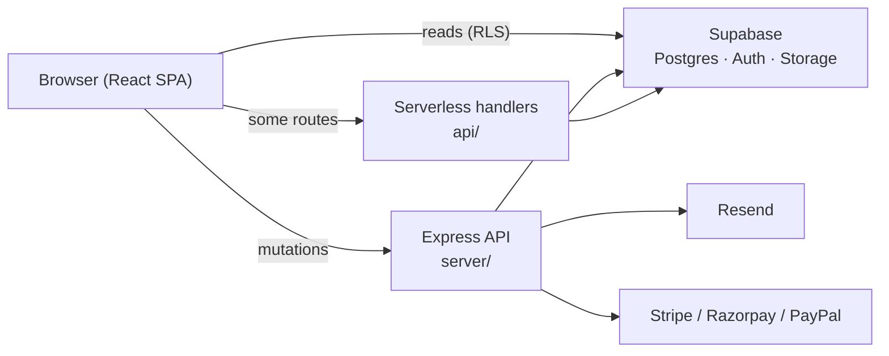

<p align="center">
  
</p>

<p align="center">
  
</p>

<p align="center">
  <strong>Open-source awards management — from submissions to judging to winner announcement.</strong>
</p>

<p align="center">
  <a href="https://github.com/Cognivo-Future-Technologies-CFT/AwardX">GitHub</a> ·
  <a href="#quick-start">Quick start</a> ·
  <a href="#documentation">Docs</a> ·
  <a href="#contributing">Contributing</a>
</p>

<p align="center">
  
  
  
  
  
</p>

---

This is a multi-tenant platform for running awards programs end to end. Create an organization, launch programs, collect entries, run multi-round judging, open public voting, and announce winners — all from one dashboard.

Built in public and designed to be **self-hosted**: clone the repo, point it at your own Supabase project, and run your awards on your infrastructure.

## Features

- **Organizations & programs** — Multi-tenant workspace with role-based access (owner, admin, program manager, judge, applicant)
- **Form builder** — Drag-and-drop entry forms with multi-step sections
- **Categories** — Nested categories and subcategories per program
- **Judging workflows** — Graph-based round scheduling with linear and visual editors
- **Judge management** — Panels, groups, category-scoped assignments, and invite links
- **Public voting** — Voting rounds with leaderboards and public program pages
- **Payments** — Paid entries via Stripe, Razorpay, or PayPal
- **Email** — Invites and mass email through Resend (org- or program-level)
- **Audit & security** — Row Level Security in Postgres, server-side authorization, audit logs

## Tech stack

| Layer | Stack |
| --- | --- |
| Frontend | Vite 6, React 19, Tailwind CSS v4, Framer Motion, React Router 6, TanStack Query |
| API | Node.js + Express (`server/`), Vercel serverless handlers (`api/`) |
| Database | Supabase (PostgreSQL, Auth, Storage, Realtime) |
| Email | Resend |
| Payments | Stripe, Razorpay, PayPal |
| Testing | Vitest, Playwright |

## Architecture



- **Reads** usually go directly from the browser to Supabase; Postgres RLS enforces access.
- **Privileged writes** (advancement, invites, judge assignment, etc.) go through the Express server, which re-checks permissions and uses the service-role key server-side only.
- A **round scheduler** runs inside the Express process and drives automatic round transitions.

## Prerequisites

- **Node.js 20+** and **npm**
- A **Supabase** project ([supabase.com](https://supabase.com) or [local Supabase CLI](https://supabase.com/docs/guides/local-development))
- *(Recommended)* A **Resend** account for transactional email
- *(Optional)* **Redis** for API caching (`REDIS_URL`)
- *(Optional)* Payment provider keys for paid entries

## Quick start

### 1. Clone and install

```bash
git clone https://github.com/Cognivo-Future-Technologies-CFT/AwardX.git
cd AwardX
npm install
```

`npm install` also installs dependencies for the Express server via a `postinstall` hook.

### 2. Configure environment

Copy the example env file and fill in your values:

```bash
cp .env.example .env
```

**Minimum required variables:**

| Variable | Where | Purpose |
| --- | --- | --- |
| `VITE_SUPABASE_URL` | Frontend | Supabase project URL |
| `VITE_SUPABASE_ANON_KEY` | Frontend | Public anon key for the browser client |
| `SUPABASE_URL` | Server | Same Supabase project URL |
| `SUPABASE_SERVICE_ROLE_KEY` | Server | Service-role key for privileged API operations |
| `VITE_SITE_URL` | Frontend | App origin, e.g. `http://localhost:3000` |

**Recommended for full functionality:**

| Variable | Purpose |
| --- | --- |
| `RESEND_API_KEY` | Send judge, team, and applicant emails |
| `RESEND_FROM` | From address, e.g. `Platform <no-reply@yourdomain.com>` |
| `VITE_BACKEND_PROXY_TARGET` | Express URL for the Vite dev proxy (default `http://localhost:5001`) |
| `REDIS_URL` | Redis cache for the API (optional; falls back to in-memory) |

See [`.env.example`](.env.example) for storage buckets and optional integrations (Sentry, Stripe, Razorpay, PayPal).

> **Security:** Never expose `SUPABASE_SERVICE_ROLE_KEY` to the browser. It bypasses Row Level Security and must stay on the server only.

### 3. Set up the database

Apply the SQL migrations in order against your Supabase Postgres instance:

```bash
# Option A — Supabase CLI (recommended)
supabase link --project-ref YOUR_PROJECT_REF
supabase db push

# Option B — run files manually in the Supabase SQL editor
# Execute supabase/migrations/*.sql in numeric order (001 → 026)
```

After schema changes, regenerate TypeScript types:

```bash
npx supabase gen types typescript --project-id YOUR_PROJECT_ID \
  > services/database.types.ts
```

### 4. Run locally

Start the frontend and API together:

```bash
npm run dev
```

| Service | URL | Notes |
| --- | --- | --- |
| Frontend (Vite) | [http://localhost:3000](http://localhost:3000) | Serves the React app |
| API (Express) | [http://localhost:5001](http://localhost:5001) | Proxied at `/api` in dev |

Verify the API is healthy:

```bash
curl http://localhost:5001/api/health
# {"ok":true}
```

Create an account via the signup page. Supabase Auth handles sign-in (email/password and OAuth providers such as Google and GitHub when configured in your Supabase project).

## Scripts

| Command | Description |
| --- | --- |
| `npm run dev` | Start Vite + Express concurrently |
| `npm run dev:client` | Frontend only |
| `npm run dev:server` | Express API only |
| `npm run build` | Production build of the frontend (`dist/`) |
| `npm run preview` | Preview the production build |
| `npm run typecheck` | TypeScript check without emit |
| `npm test` | Run Vitest with coverage |
| `npm run test:watch` | Vitest in watch mode |
| `npm run test:e2e` | Playwright end-to-end tests |

## Project structure

```
/
├── components/          # React UI — marketing pages and dashboard
├── server/              # Express API (Node 20+, port 5001)
├── api/                 # Vercel serverless route handlers
├── supabase/migrations/ # Versioned PostgreSQL migrations (RLS-aware)
├── services/            # Frontend data layer (Supabase client, API helpers)
├── lib/                 # Shared utilities
├── hooks/               # React hooks
├── tests/               # Vitest unit & integration tests
├── docs/                # Architecture and feature notes
└── public/              # Static assets
```

## Deployment

The platform splits cleanly across three deploy targets:

1. **Frontend** — `npm run build`, then host `dist/` on any static host (Vercel, Netlify, Cloudflare Pages).
2. **Serverless handlers** — The `api/` folder is picked up automatically on Vercel (`vercel.json` at the repo root).
3. **Express server** — Host `server/` on Fly.io, Render, Railway, or any Node-friendly platform. Set `PORT` and all server-side env vars.

**Production checklist**

- Apply all migrations to your production Supabase project.
- Set `VITE_BACKEND_URL` to your public Express API URL (leave empty in local dev).
- Keep `SUPABASE_SERVICE_ROLE_KEY`, `RESEND_API_KEY`, and payment secrets on the server only.
- Configure Supabase Auth redirect URLs for your production domain.

## Documentation

In-app documentation lives at `/docs` when the dev server is running. Additional notes are in the [`docs/`](docs/) folder, including:

- [`docs/SCHEDULE_ROUNDS_ARCHITECTURE.md`](docs/SCHEDULE_ROUNDS_ARCHITECTURE.md) — Round scheduling and advancement
- [`docs/MOBILE_APP_FEATURES.md`](docs/MOBILE_APP_FEATURES.md) — Mobile-oriented feature notes

## Testing

```bash
# Unit + integration (Vitest)
npm test

# Targeted suites
npx vitest run tests/unit/scheduleRounds
npx vitest run tests/integration/scheduleRounds

# End-to-end (Playwright)
npm run test:e2e
```

## Contributing

Contributions are welcome. The project is built in public — issues, bug reports, and pull requests help make it better for everyone running awards programs.

1. **Fork** the repository and create a branch from `main`.
2. **Set up** a local environment following [Quick start](#quick-start).
3. **Make your change** — keep diffs focused; match existing code style and conventions.
4. **Run checks** — `npm run typecheck` and `npm test` before opening a PR.
5. **Open a pull request** with a clear description of what changed and why.

For larger changes (new round types, schema changes, payment flows), open an issue first so we can align on approach.

## Roadmap & use cases

The platform supports a wide range of program types — design awards, hackathons, academic admissions, fellowships, abstract submissions, and more. See [`workflow_readmes/`](workflow_readmes/) for workflow-specific notes.

## License

This project is open source under the [GNU Affero General Public License v3.0 (AGPL-3.0)](LICENSE).

If you modify this software and run it as a network service (for example, a hosted SaaS instance), AGPL-3.0 requires you to make the corresponding source code of your modified version available to users who interact with it over the network.

---

<p align="center">
  Clone the repo. Run your awards.
</p>
